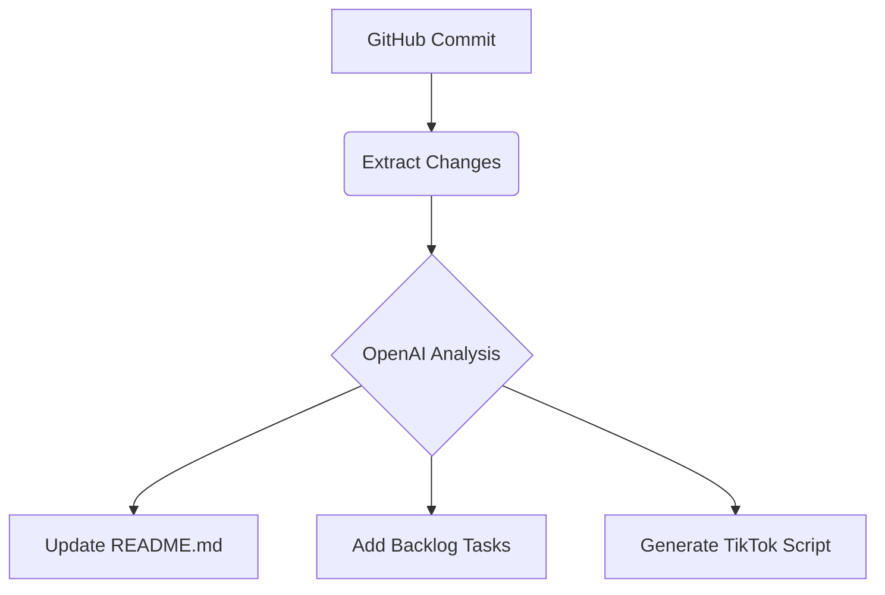

# ReadME

# 🤖 Self-Writing Documentation & Backlog Generator

**Automatically documents your coding projects + generates next steps**

*Built with n8n, OpenAI, and GitHub API*

## 🚀 Why This Exists

As a solo developer building:

- **Zero time** for proper documentation
- **Constantly forgetting** next steps
- **Struggling** to create TikTok content

This bot solves all three by **auto-generating**:

1. 📝 Project documentation (READMEs/changelogs)
2. 📋 Backlog tasks (prioritized)
3. 📱 Social media scripts (TikTok hooks)

## Commercial Applications

This tool enables:

- **Time Savings** (5+ hrs/week documentation)
- **Content Creation** (Auto-generated tutorials)
- **Team Scaling** (Always-updated project tracking)

*For implementation inquiries: [Contact Me](mailto:ewetseklc@gmail.com)*

## ⚡ How It Works

